# Decodificador BCD a Display de 7 Segmentos

Este repositorio contiene la documentación, desarrollo lógico y esquemas de los circuitos resultantes del diseño de un decodificador de código **BCD (Binary Coded Decimal)** a un **Display de 7 Segmentos** (cátodo común).

La actividad consistió en definir el comportamiento deseado mediante una tabla de verdad, simplificar las funciones lógicas de salida para cada segmento utilizando **Mapas de Karnaugh** y, finalmente, diseñar e implementar los circuitos esquemáticos correspondientes.

---

## Tabla de Verdad

A continuación se presenta la tabla de verdad empleada para el diseño. Las entradas representan un dígito en formato BCD ($A, B, C, D$ donde $A$ es el bit más significativo - MSB, y $D$ es el bit menos significativo - LSB). Las salidas corresponden a cada uno de los segmentos ($a, b, c, d, e, f, g$) activos en alto (1) para encender el segmento.

| Dígito | A (MSB) | B | C | D (LSB) | a | b | c | d | e | f | g |
| :---: | :---: | :---: | :---: | :---: | :---: | :---: | :---: | :---: | :---: | :---: | :---: |
| **0** | 0 | 0 | 0 | 0 | 1 | 1 | 1 | 1 | 1 | 1 | 0 |
| **1** | 0 | 0 | 0 | 1 | 0 | 1 | 1 | 0 | 0 | 0 | 0 |
| **2** | 0 | 0 | 1 | 0 | 1 | 1 | 0 | 1 | 1 | 0 | 1 |
| **3** | 0 | 0 | 1 | 1 | 1 | 1 | 1 | 1 | 0 | 0 | 1 |
| **4** | 0 | 1 | 0 | 0 | 0 | 1 | 1 | 0 | 0 | 1 | 1 |
| **5** | 0 | 1 | 0 | 1 | 1 | 0 | 1 | 1 | 0 | 1 | 1 |
| **6** | 0 | 1 | 1 | 0 | 1 | 0 | 1 | 1 | 1 | 1 | 1 |
| **7** | 0 | 1 | 1 | 1 | 1 | 1 | 1 | 0 | 0 | 0 | 0 |
| **8** | 1 | 0 | 0 | 0 | 1 | 1 | 1 | 1 | 1 | 1 | 1 |
| **9** | 1 | 0 | 0 | 1 | 1 | 1 | 1 | 1 | 0 | 1 | 1 |

> [!NOTE]
> Las combinaciones binarias de entrada del **10 al 15** ($1010_2$ a $1111_2$) no se utilizan en BCD. Por lo tanto, en los mapas de Karnaugh se trataron como estados de **"no importa" (Don't Cares - X)**, lo que permitió simplificar significativamente las expresiones resultantes.

---

## Mapas de Karnaugh y Ecuaciones

Para cada segmento se realizó la simplificación por mapas de Karnaugh de 4 variables. Las imágenes correspondientes muestran el agrupamiento de los unos ($1$) y los términos de no importa ($X$).

### Segmento A
* **Ecuación lógica simplificada:**
  $$a = A + C + BD + B'D'$$

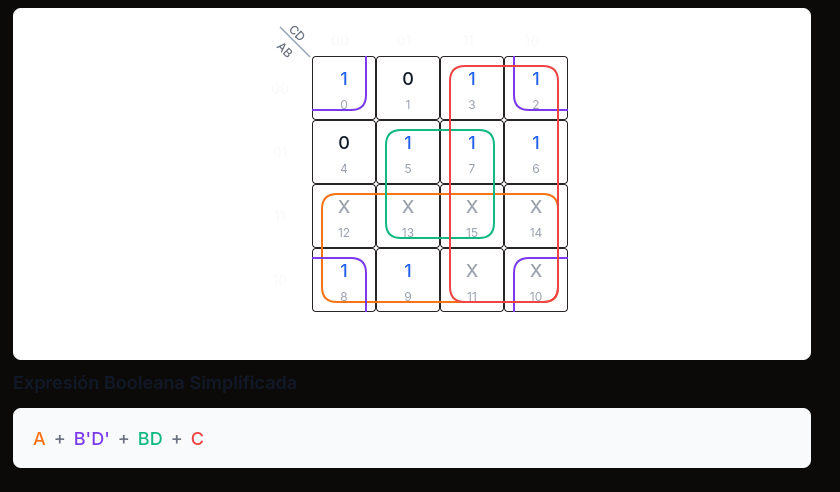

### Segmento B
* **Ecuación lógica simplificada:**
  $$b = B' + C'D' + CD$$

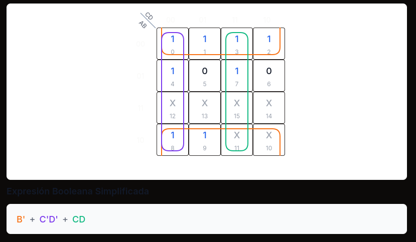

### Segmento C
* **Ecuación lógica simplificada:**
  $$c = B + D + C'$$

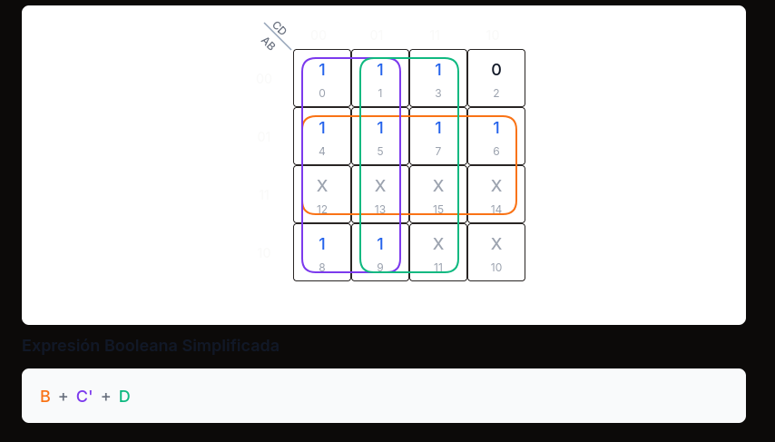

### Segmento D
* **Ecuación lógica simplificada:**
  $$d = A + B'D' + B'C + CD' + BC'D$$

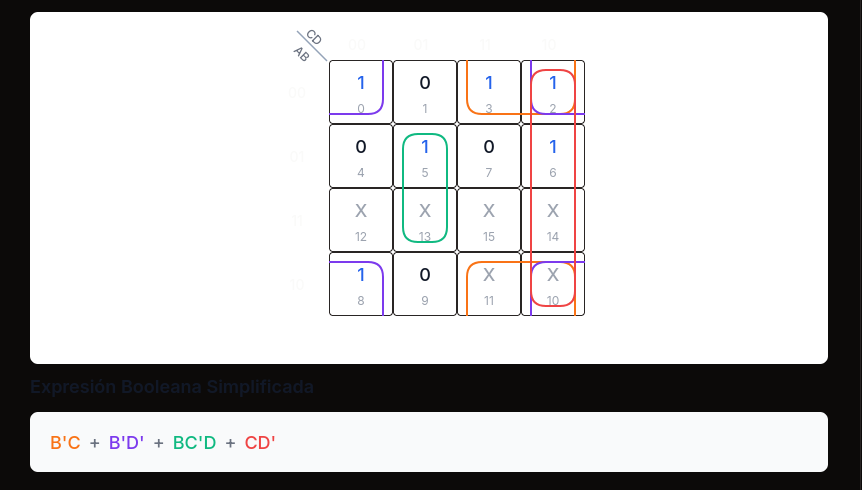

### Segmento E
* **Ecuación lógica simplificada:**
  $$e = B'D' + CD'$$

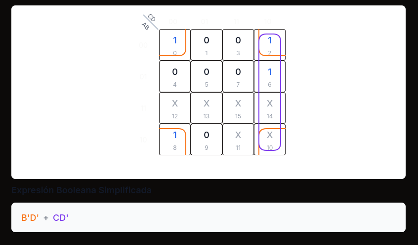

### Segmento F
* **Ecuación lógica simplificada:**
  $$f = A + BC' + BD' + C'D'$$

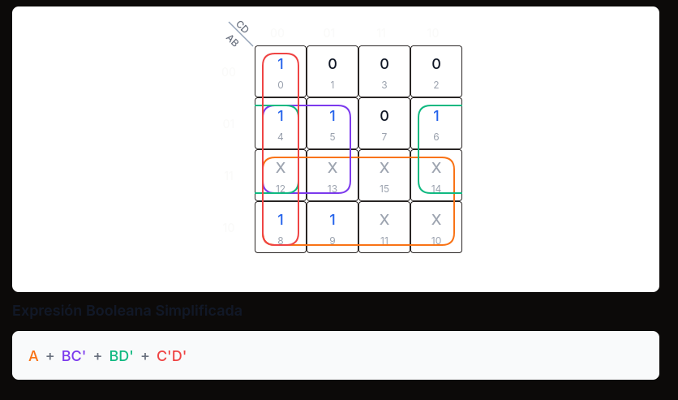

### Segmento G
* **Ecuación lógica simplificada:**
  $$g = A + B'C + BC' + BD'$$

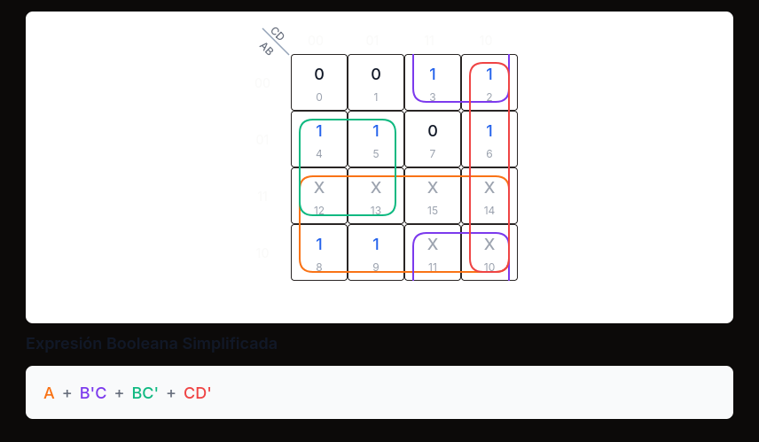

---

## Circuitos de los Segmentos

A continuación se presentan las capturas de pantalla de las simulaciones y diagramas lógicos desarrollados para la actividad.

### Circuito General Completo
Muestra la integración de todas las compuertas lógicas y el display de 7 segmentos.

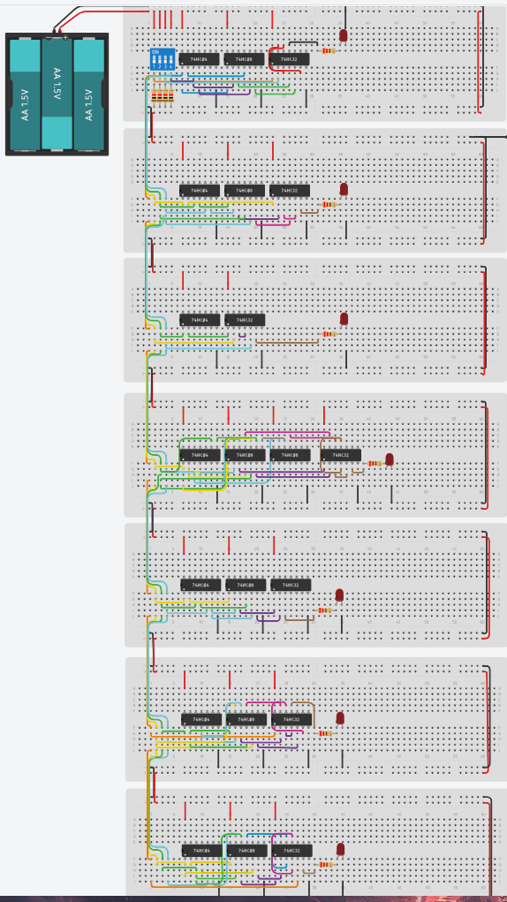

---

### Circuitos Individuales por Segmento

A continuación se listan los esquemas individuales correspondientes al diseño lógico implementado para cada salida del display:

#### Segmento A
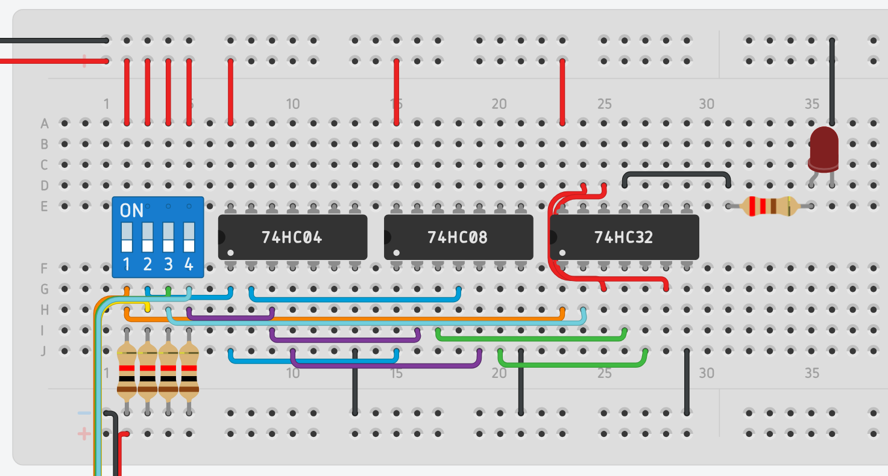

#### Segmento B
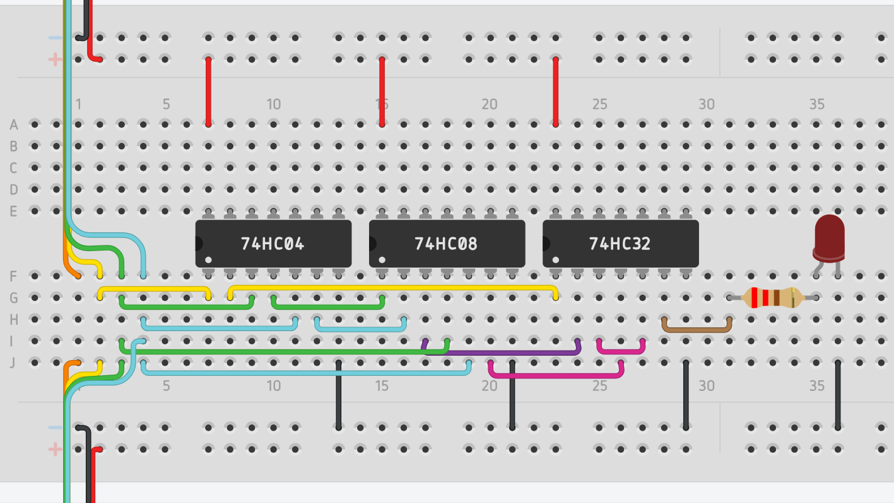

#### Segmento C
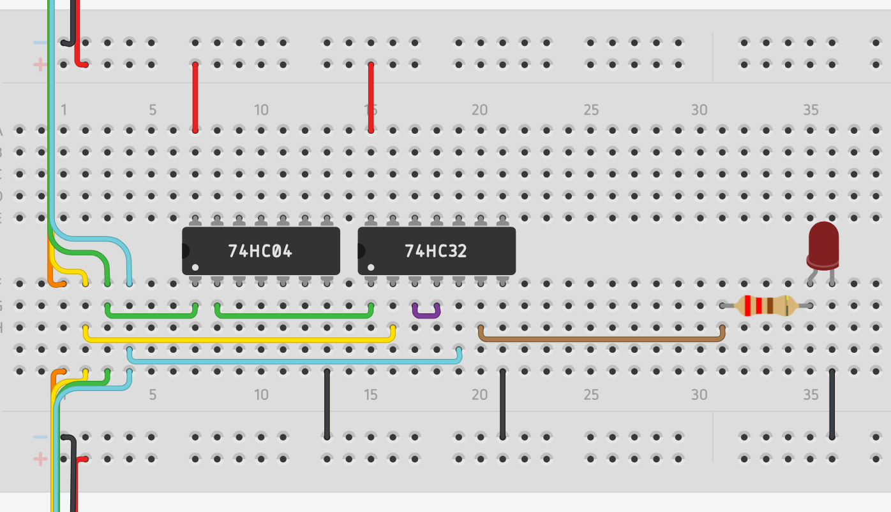

#### Segmento D
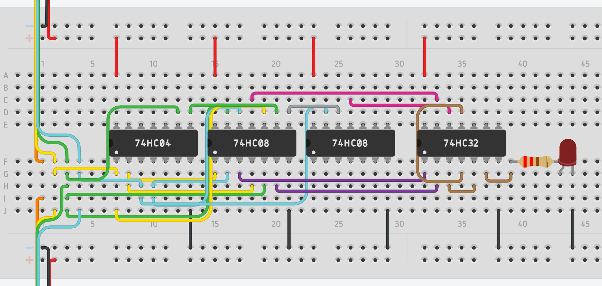

#### Segmento E
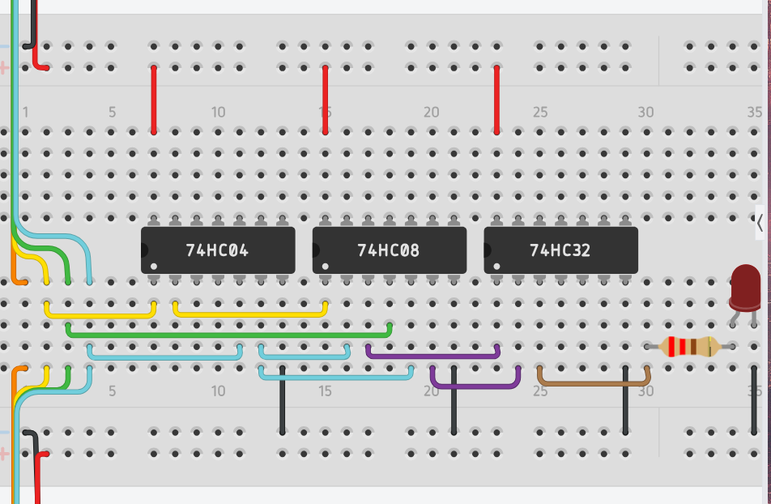

#### Segmento F
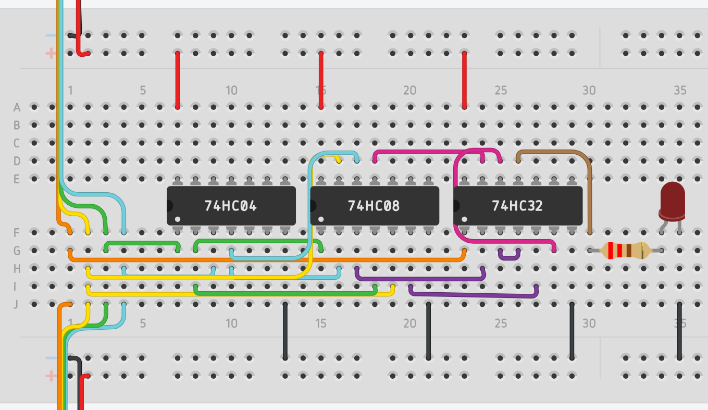

#### Segmento G
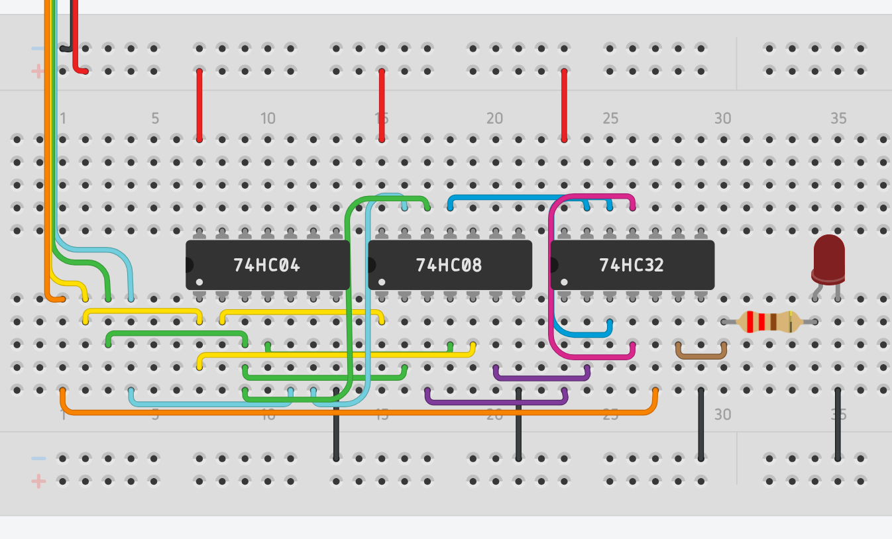

---

## Metodología del Proyecto
1. **Simplificación Booleana:** Diseño y resolución de mapas de Karnaugh de 4 variables utilizando las condiciones redundantes (don't cares) para obtener expresiones de suma de productos (SOP) minimales.
2. **Simulación:** Implementación del diseño lógico en software de simulación electrónica para verificar la correcta visualización de los dígitos del 0 al 9.
